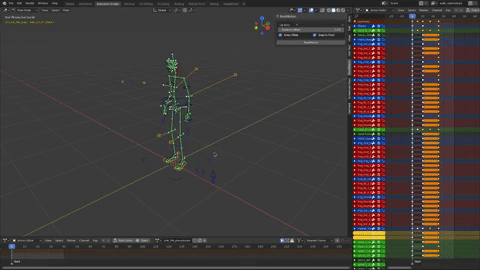
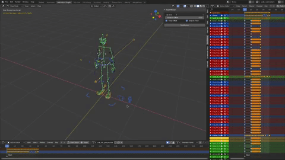

# RootMotion
Rootmotion for Blender. Transfer movement from feet to root bone and then from root bone to the object itself! Works with NLA Layers and FBX exporter.

## Feet to Root:

## Root to Object:

## Unroot
Select the root bone, then run Unroot to transfer motion from root bone to its children.

## Unslide
Select the sliding bone and click "Unslide" to move the root bone in the opposite direction, keeping it from sliding.

## Snap to floor
Snap a bone to floor. Alternatively, select a reference bone and then the bone to move, the bone to move moves down the distance required to snap the reference bone to the floor.

## Steps to make RootMotion work for Game Engines:
1. Be in Pose mode.
2. Select Character's feet (as many as you like).
3. Press 'RootMotion' button.
4. Select Root bone
5. Press 'RootMotion' again to transfer animation to the armature object.

## Known Limitation
If you have a setup where the bones have a ChildOf/Armature constraint that switches between which bone it follows (knee/elb IK or View target bones might have it), you need to make a separate parent that contains those constraints and animate the child instead. This only applies to bones that dont have a parent and were parented through constraints. 
If you added a ChildOf constraint to a bone that actually had a parent you dont need to worry about anything.

## Installation
1. Unzip archive.
2. Install 'rootmotion.py' or place manually into addons folder.
